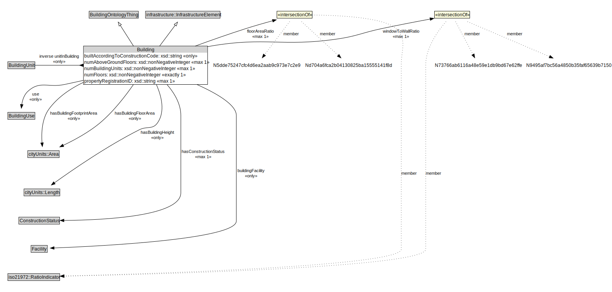

# Building

<a href="../../diagrams/Building__Building.dot.svg">Open interactive Building diagram</a>

## Formalization for Building

| Property | Constraint |
|----------|------------|
| buildingFacility | only Facility |
| builtAccordingToConstructionCode | only xsd::string |
| floorAreaRatio | max 1 (N5dde75247cfc4d6ea2aab9c973e7c2e9 and Nd704a6fca2b04130825ba15555141f8d and iso21972::RatioIndicator) |
| hasBuildingFloorArea | only cityUnits::Area |
| hasBuildingFootprintArea | only cityUnits::Area |
| hasBuildingHeight | only cityUnits::Length |
| hasConstructionStatus | max 1 ConstructionStatus |
| inverse unitInBuilding | only BuildingUnit |
| numAboveGroundFloors | max 1 xsd::nonNegativeInteger |
| numBuildingUnits | max 1 xsd::nonNegativeInteger |
| numFloors | exactly 1 xsd::nonNegativeInteger |
| propertyRegistrationID | max 1 owl::Thing |
| subClassOf | BuildingOntologyThing |
| subClassOf | BuildingOntologyThing |
| subClassOf | infrastructure::InfrastructureElement |
| use | only BuildingUse |
| windowToWallRatio | max 1 (N73766ab6116a48e59e1db9bd67e62ffe and N9495af7bc56a4850b35faf65639b7150 and iso21972::RatioIndicator) |

