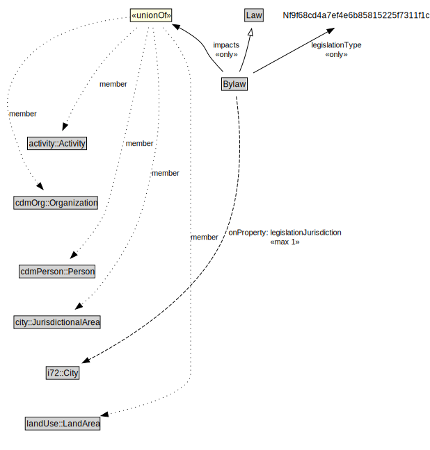

# Bylaw

<a href="../../diagrams/Bylaw__Bylaw.dot.svg">Open interactive Bylaw diagram</a>

## Specializations of Bylaw

| Class | Description |
|-------|-------------|
| [Amending Bylaw (Bylaw)](Bylaw__AmendingBylaw.md) |  |
| [Main Bylaw (Bylaw)](Bylaw__MainBylaw.md) |  |
| [Revision Bylaw (Bylaw)](Bylaw__RevisionBylaw.md) |  |

## Formalization for Bylaw

| Property | Constraint |
|----------|------------|
| impacts | only (activity::Activity or city::JurisdictionalArea or landUse::LandArea or cdmOrg::Organization or cdmPerson::Person) |
| legislationJurisdiction | max 1 i72::City |
| legislationType | only Nf9f68cd4a7ef4e6b85815225f7311f1c |
| subClassOf | Law |
| subClassOf | Law |

