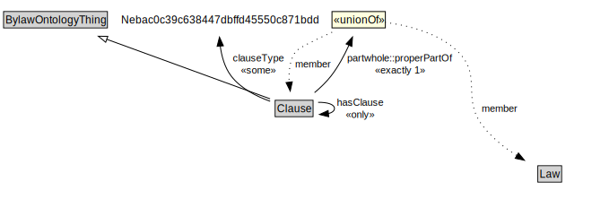

# Clause

<a href="../../diagrams/Bylaw__Clause.dot.svg">Open interactive Clause diagram</a>

## Formalization for Clause

| Property | Constraint |
|----------|------------|
| clauseType | some Nebac0c39c638447dbffd45550c871bdd |
| genProp::hasDescription | max 1 xsd::string |
| genProp::hasIdentifier | max 1 xsd::string |
| genProp::hasName | max 1 xsd::string |
| hasClause | only Clause |
| partwhole::properPartOf | exactly 1 (Clause or Law) |
| subClassOf | BylawOntologyThing |
| subClassOf | BylawOntologyThing |

## Used by classes

| Class | Property |
|-------|----------|
| [Clause (Bylaw)](Bylaw__Clause.md) | hasClause |
| [Law (Bylaw)](Bylaw__Law.md) | hasClause |
| [Law (Bylaw)](Bylaw__Law.md) | hasPenaltyClause |
| [Law (Bylaw)](Bylaw__Law.md) | hasRepealClause |
| [Law (Bylaw)](Bylaw__Law.md) | hasSeveranceClause |
| [Law (Bylaw)](Bylaw__Law.md) | hasTransitionClause |
| [Schedule (Bylaw)](Bylaw__Schedule.md) | hasClause |

