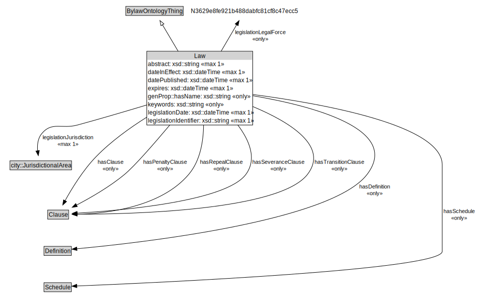

# Law

<a href="../../diagrams/Bylaw__Law.dot.svg">Open interactive Law diagram</a>

## Specializations of Law

| Class | Description |
|-------|-------------|
| [Amending Bylaw (Bylaw)](Bylaw__AmendingBylaw.md) |  |
| [Bylaw (Bylaw)](Bylaw__Bylaw.md) |  |
| [Main Bylaw (Bylaw)](Bylaw__MainBylaw.md) |  |
| [Revision Bylaw (Bylaw)](Bylaw__RevisionBylaw.md) |  |

## Formalization for Law

| Property | Constraint |
|----------|------------|
| abstract | max 1 xsd::string |
| dateInEffect | max 1 xsd::dateTime |
| datePublished | max 1 xsd::dateTime |
| expires | max 1 xsd::dateTime |
| genProp::hasName | only xsd::string |
| hasClause | only Clause |
| hasDefinition | only Definition |
| hasPenaltyClause | only Clause |
| hasRepealClause | only Clause |
| hasSchedule | only Schedule |
| hasSeveranceClause | only Clause |
| hasTransitionClause | only Clause |
| keywords | only xsd::string |
| legislationDate | max 1 xsd::dateTime |
| legislationIdentifier | max 1 xsd::string |
| legislationJurisdiction | max 1 city::JurisdictionalArea |
| legislationLegalForce | only N3629e8fe921b488dabfc81cf8c47ecc5 |
| subClassOf | BylawOntologyThing |
| subClassOf | BylawOntologyThing |

