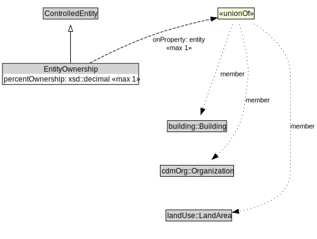

# EntityOwnership

<a href="../../diagrams/CityResident__EntityOwnership.dot.svg">Open interactive EntityOwnership diagram</a>

## Formalization for EntityOwnership

| Property | Constraint |
|----------|------------|
| entity | max 1 (building::Building or landUse::LandArea or cdmOrg::Organization) |
| percentOwnership | max 1 xsd::decimal |
| subClassOf | ControlledEntity |
| subClassOf | ControlledEntity |

## Used by classes

| Class | Property |
|-------|----------|
| [City Resident (CityResident)](CityResident__CityResident.md) | owns |

